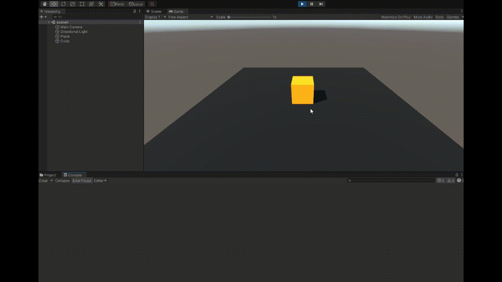
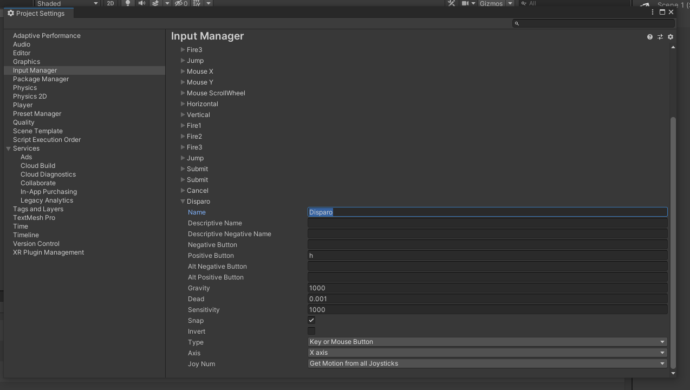
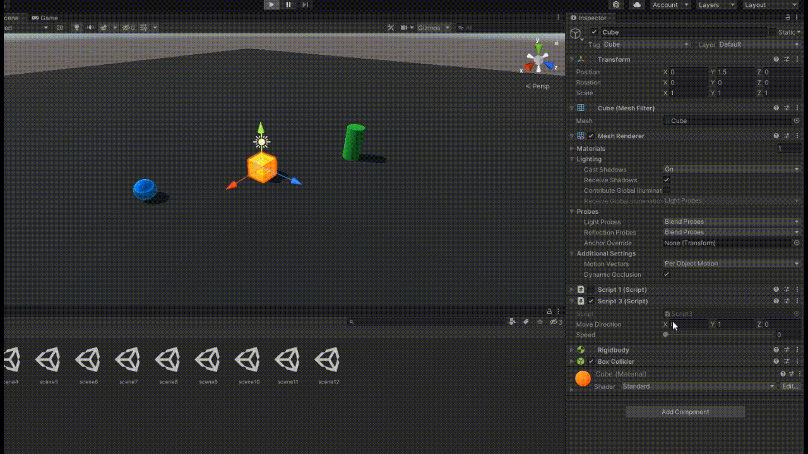
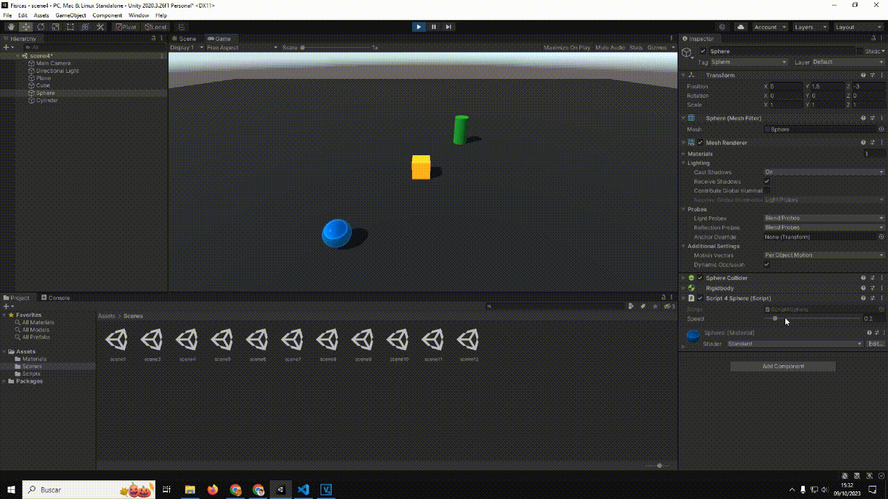
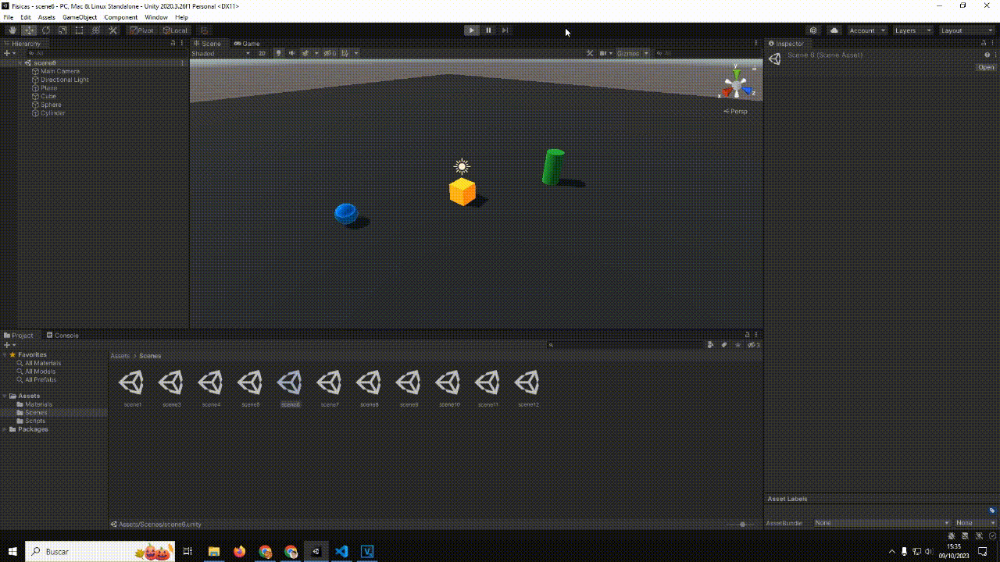
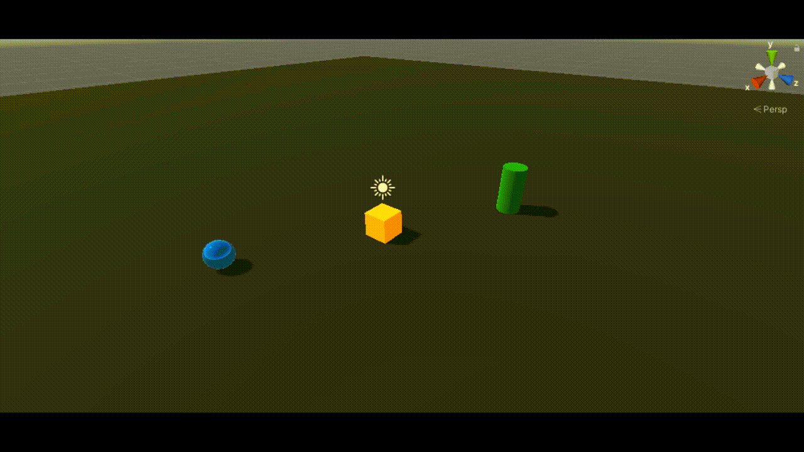
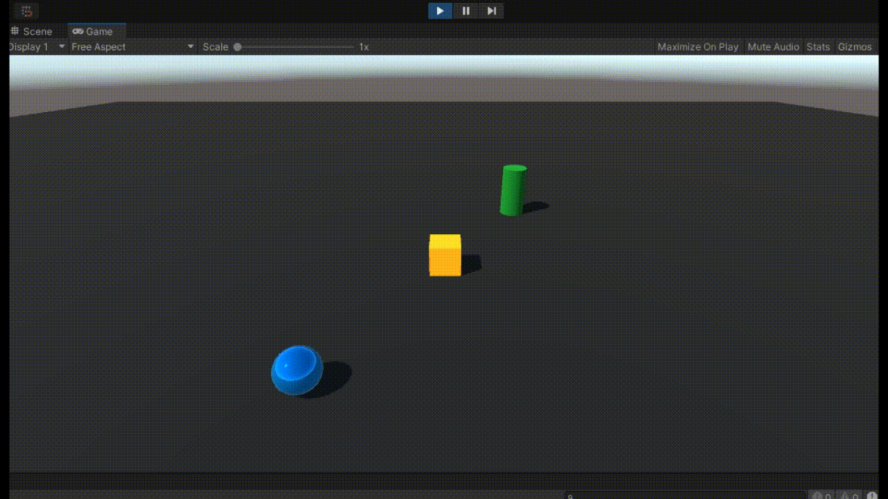
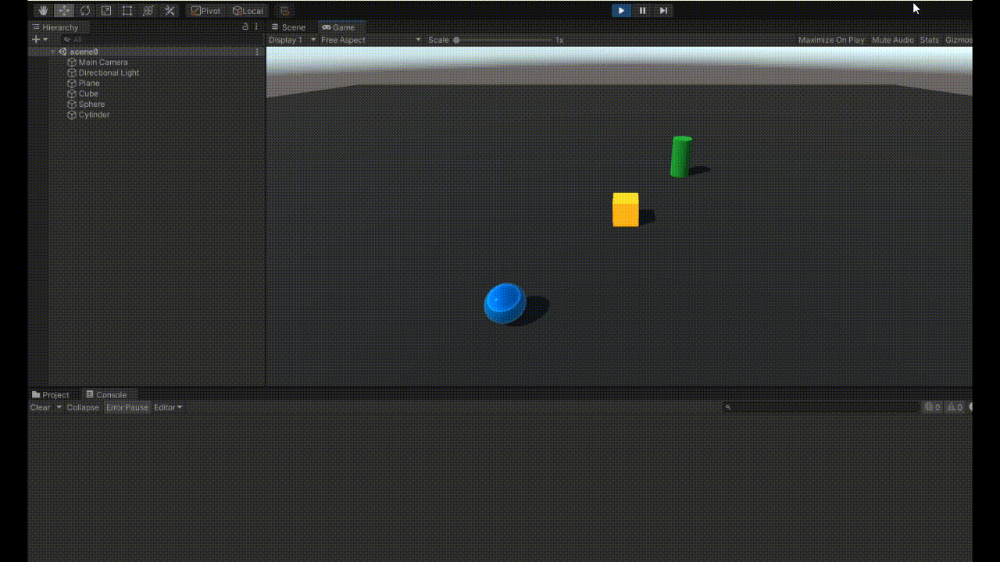
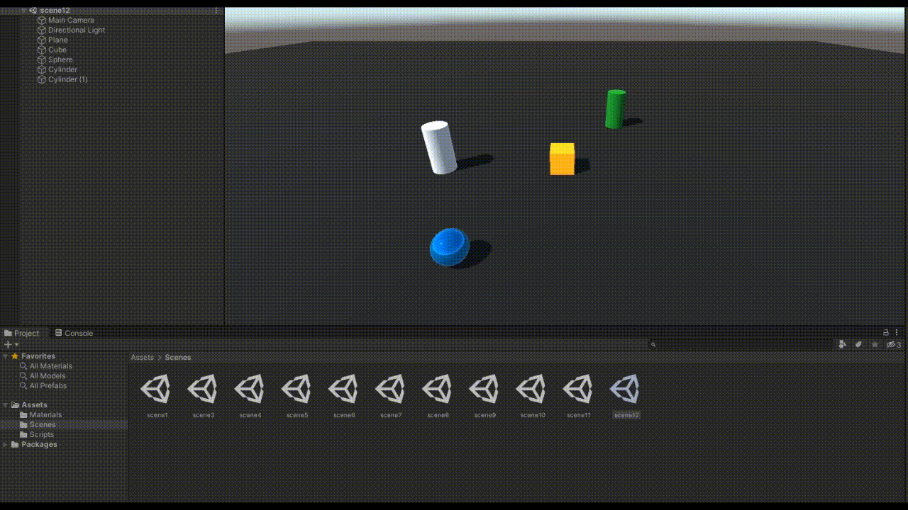

# Físicas
## Práctica 3 - Interfaces Inteligentes

En este repositorio se encuentra el tercer proyecto en Unity de la asignatura de Interfaces Inteligentes, en él, se debían crear varias escenas con objetos para realizar diferentes objetivos a través de scriptsy el uso de movimiento y físicas

En el primer ejercicio se pedía tener un cubo que enseñase por consola el resultado de multiplicar la velocidad por el valor del eje vertical y por el valor del eje horizontal cada vez que se pulsan las teclas flecha arriba-abajo ó flecha izquierda-derecha

En el segundo ejercicio se pedía asignar a la tecla H la función disparo

En la tercera pregunta, se pedía un script asociado al cubo que en cada iteración trasladase al cubo una cantidad proporcional a un vector que indica la dirección del movimiento que debe poder modificarse en el inspector. La velocidad a la que se produce el movimiento también se especifica en el inspector, con la propiedad speed.

Cuando se duplica las coordenadas de la dirección, el cubo viaja el doble de rápido hacia esa dirección, lo mismo pasa cuando se duplica la velocidad de movimiento ya que se multiplica por el propio vector.

Cuando la velocidad es menor que 1, el vector se multiplica por la velocidad haciendo que vaya en dirección contraria al vector si es un número negativo o muy lento si es un número entre 0 y 1.

Cuando el cubo tiene y > 0 empieza en el aire y cuando el movimiento es relativo al cubo en lugar de al mundo, el cubo se mueve de manera más errática ya que se mueve en dirección de donde tiene su sistema de referencia.

El cuarto enunciado pide mover el cubo con las flechas y la esfera con w-a-s-d

El quinto enunciado pedía convertir el movimiento de manera que fuera proporcional al tiempo transcurrido durante los gen frames, para esto se cambió el script de manera que se multiplicase la velocidad de movimiento por Time.deltaTime

El sexto enunciado pedía lograr que el movimiento del cubo estuviese diorijido siempre hacia la esfera sin estar influenciado por la distancia

En la escena pedida nº siete se buscaba cambiar este movimiento para que el cubo apuntase a la esfera y se moviese en esa dirección

La octava pregunta pedía recrear un control de tanque típico, es decir, usar el eje horizontal para girar el cubo.

La escena 9 pedía configurar el cilindro como objeto físico para que cuando el cubo o la esfera colisionaran con él, escribiese por consola su etiqueta.

En la siguiente escena, se pedía lo mismo, solo que únicamente se estableciera el cubo como objeto cinemático y la esfera como objeto físico

En la decimoprimera pregunta, se pedía realizar exactamente lo mismo, esta vez con el cilindro como objeto Trigger

Por último, en el enunciado 12, se pedía añadir un nuevo cilindro como objeto físico, moverlo con teclas y programarle un movimiento que le permita dirigirse a la esfera.

Estos son los resultados de las pruebas:

 - Con la esfera 10 veces más masiva que el cilindro, dicha esfera se mueve muy lentamente cuando el cilindro colisiona con ella. En el caso contrario, el cilindro casi no tiene problemas en mover la esfera cuando choca.
 
 - Siendo la esfera cinemática, es imposible ser movida por el cilindro al chocar

 - Siendo el cilindro cinemático, la esfera opone 0 resistencia al ser empujada

 - Cuando el cilindro duplica su fricción, podemos ver como el coste de empujar la esfera se intensifica
